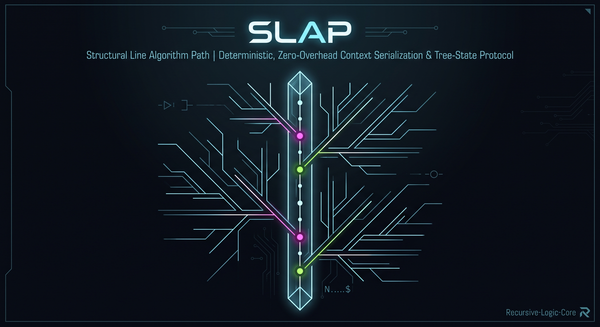

<div align="center">



# SLAP
### Structural Line Algorithm Path

**Deterministic, zero-overhead context serialization and tree-state protocol.**

[](LICENSE)
[]()
[]()

</div>

> **Deterministic Protocol Specification**  
> Designed and specified by Architect M.M.M. Python code provided as a reference implementation artifact.
> **Operational Boundary:**  
> SLAP is a universal, bidirectional runtime and serialization protocol designed for zero-overhead data transmission, tree-state management, and edge execution. It is not intended to displace persistent storage engines (such as SQL or document stores), but operates dynamically at the compute and network boundary—transforming heavyweight payloads into deterministic, bracket-free streams and vice versa without disrupting existing backend infrastructure.

---

## Abstract

Modern data serialization formats (JSON, YAML, XML) carry massive historical ballast: redundant quotation marks, nested closing brackets, fragile indentation rules, and zero native support for state inheritance.

**SLAP (Structural Line Algorithm Path)** is an ultra-minimalist, line-deterministic protocol designed for pure efficiency. It maps hierarchical tree topologies and cascading context inheritance using single-character prefix vectors. No brackets, no commas, no syntax noise.

---

## Core Principles

1. **Zero Syntax Overhead:** Only semantic data and explicit prefix markers exist. Whitespace within identifiers is strictly prohibited (use `_`).
2. **Deterministic Single-Pass Parsing (**O(N)**):** Evaluated strictly line-by-line using a lightweight state machine. No lookaheads, no backtrack buffers, no bracket-balancing.
3. **Cascading State Inheritance & Dynamic Scope:** Attributes defined at depth $N$ attach to the active node at that depth and automatically cascade down into all subsequent child nodes declared *after* them. Prior siblings remain immutable.
4. **Visual Depth Indexing:** Structural hierarchy is declared at index `0` of each line.
5. **Zero System Refactoring (Drop-in In-Memory Layer):** Existing enterprise pipelines remain 100% standard (JSON/SQL). SLAP operates solely as a micro-serialization gateway prior to model ingestion, eliminating token bloat without requiring changes to persistence architecture.

---

## Syntax Specification

### 1. Entities & Objects (`-`, `--`, `---`)
* `-` declares a root entity (resets previous context).
* Each additional `-` increases the hierarchical depth level ($N+1$).

### 2. Attributes & States (`.`, `..`, `...`)
* Prefix count corresponds to the target hierarchical depth level:
  * `.` binds to the active root node (depth 1) and cascades to all following descendants.
  * `..` binds to the active depth-2 sub-node and cascades to its subsequent children.
* **Lexical Downstream Flow:** Attributes apply dynamically to their parent scope and downstream siblings/children instantiated *after* the attribute declaration.
* Key-value pairs are delimited by a single colon (`:`).

---

## Protocol Comparison

### SLAP Representation
```text
-cluster_alpha
.zone:eu_central
.security:strict
--node_01
--node_02
..role:backup
.maintenance:true
--node_03
```

### Legacy JSON Representation
```json
{
  "cluster_alpha": {
    "zone": "eu_central",
    "security": "strict",
    "nodes": [
      { 
        "id": "node_01", 
        "zone": "eu_central", 
        "security": "strict" 
      },
      { 
        "id": "node_02", 
        "zone": "eu_central", 
        "security": "strict", 
        "role": "backup" 
      },
      { 
        "id": "node_03", 
        "zone": "eu_central", 
        "security": "strict", 
        "maintenance": "true" 
      }
    ]
  }
}
```

*Result: SLAP reduces character payload by over 50% while completely removing bracket-closure failure vectors.*

---

## Reference Implementation

The reference parser is provided in [`SLAP.py`](SLAP.py) as a standalone, zero-dependency engine:

```python
from SLAP import parse_slap

raw_slap_data = """
-alpha
.status:active
--beta
--gamma
..role:worker
.maintenance:true
--delta
"""

nodes = parse_slap(raw_slap_data)
for node in nodes:
  print(f"Path: {node['path']} | Attributes: {node['attributes']}")
```

---

## License

This project is licensed under the MIT License - see the [LICENSE](LICENSE) file for details.


## Contact & Architecture Core
Developed and maintained by **Architect M.M.M.**  
Direct contact: `arch_mmm@proton.me`
